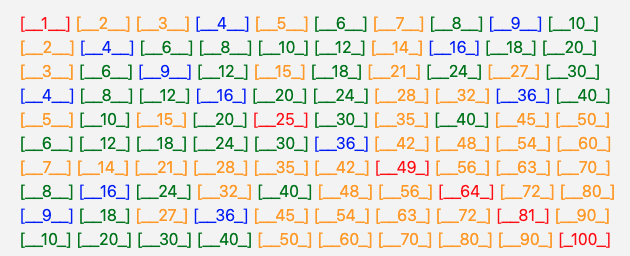

# javascript-math-tools
A set of javascript scripts to help with math, such as multiplication tables in a matrix

Multiplication (often denoted by the cross symbol ×, by the mid-line dot operator ⋅, by juxtaposition, or, on computers, by an asterisk *) is one of the four elementary mathematical operations of arithmetic, with the other ones being addition, subtraction, and division. The result of a multiplication operation is called a product.

The multiplication of whole numbers may be thought of as repeated addition; that is, the multiplication of two numbers is equivalent to adding as many copies of one of them, the multiplicand, as the quantity of the other one, the multiplier. Both numbers can be referred to as factors.

